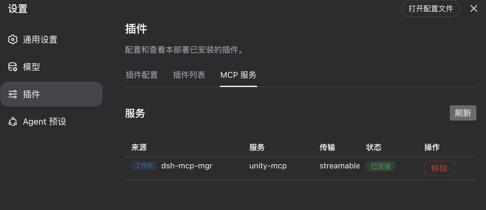

# dsh-mcp-mgr

[English](README.md) | 中文

dsh 的工作区级 MCP 管理器：在每个工作区的 `.dsh/dshmm/mcp.json`（类 Claude/Codex 的 `mcpServers` 格式）中声明 MCP server，自动发现并动态注册为 dsh 插件实例，并提供设置页管理界面。

## 功能

- **工作区 MCP**：自动发现已登记工作区的 `mcp.json`，变更热同步，工作区删除自动卸载
- **Profile MCP 展示**：非工作区（profile patch / bundle / `--patch`）的 mcp-client 统一展示与管理
- **设置页 Tab**：MCP 服务列表：来源、状态、查删等
- **严格模式**：勾选后仅启用当前工作区（边栏选中会话所属工作区）的 MCP 服务，切换工作区自动卸载其他工作区的 MCP；默认关闭（所有工作区 MCP 并存）
- 工作区的 MCP 以 dsh 规范的 `mcp__<serverName>__<tool>` 命名注册，多 server / 多来源天然隔离



## 安装与卸载

安装：
```sh
npx @deepseek-ai/dsh plugin --profile web add dsh-mcp-mgr
```

启动：
```sh
npx @deepseek-ai/dsh web
```

卸载：
```sh
npx @deepseek-ai/dsh plugin --profile web remove dsh-mcp-mgr
```

## 工作区配置

插件自动识别工作区根目录下的 `.dsh/dshmm/mcp.json`，文件内容示例如下：

```json
{
  "mcpServers": {
    "unity-mcp": { "type": "http", "url": "http://localhost:8090/" },
    "filesystem": { "type": "stdio", "command": "npx", "args": ["-y", "@modelcontextprotocol/server-filesystem", "/data"] }
  }
}
```

- `type` 缺省视为远程 Streamable HTTP；支持 `${VAR}` 环境变量展开
- stdio server 的 cwd 默认为工作区根目录
- serverName 全局唯一，冲突时后加载者报错（UI 标冲突）

## 开发需知

构建相关：

```sh
# host 插件
tsc -p packages/dsh-mcp-mgr && node gen.mjs

# UI 插件（ui 包目录）
tsc -p packages/dsh-mcp-mgr-ui && tsdown --config-loader tsx --env.DSH_BUILD_FACE client

# 回归
node verify.mjs
```

注意：改动 `src/types.ts`（wire 字段）后必须重跑 `gen.mjs` 并重打 UI bundle——typert 客户端 codec 过期时，严格 codec 会静默剥离未知字段（如 `connected` 丢失导致状态永远显示错误）。

本地（源码）安装验证与卸载：

```sh
# 安装
node scripts/install.mjs

# 卸载
node scripts/uninstall.mjs
```

设计文档见 `Doc/requirements.md`。
